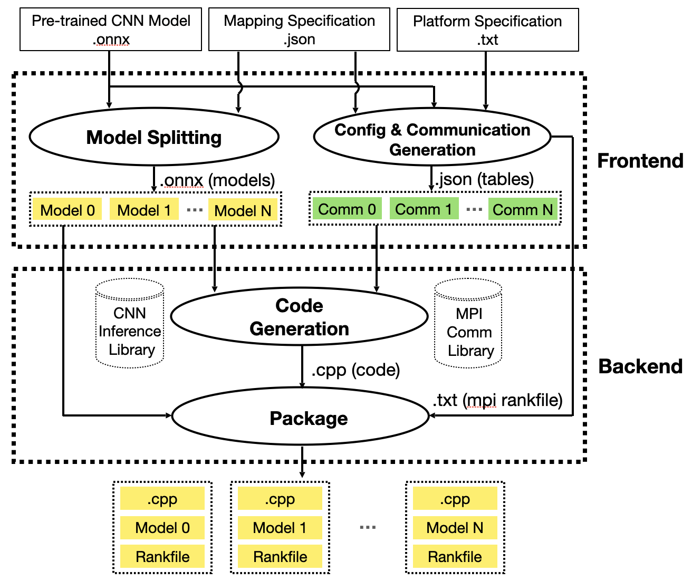

# README

# Open source

This repository provides a unified interface for specifying a CNN model with Open Neural Network Exchange (ONNX) support, the model partitioning, and the target edge devices. Inside the CNN inference library, we integrate hybrid OpenMP and MPI to support the exploitation of parallelism among and within the edge devices (i.e., exploiting multi-core execution).

  

With different Mapping Specifications, users can quickly and flexibly change the CNN model partitioning and mapping of partitions onto resources of edge devices. The hardware configurations in the automated code generation step can also be modified to adapt to user requirements targeting or other heterogeneous edge platforms.

Thanks to Lihui and atanmarko's [NCNN](https://github.com/atanmarko/ncnn-with-cuda) providing a cross-platform inference engine library that supports GPU acceleration via, e.g., VULKAN & CUDA APIs. We extend NCNN with OPENMP + MPI to support Multi-node Inference and distribution of the most commonly used CNN network over multiple devices/nodes at the edge. 

## ncnn

[ncnn](https://github.com/Tencent/ncnn) is a high-performance neural network inference computing framework optimized for mobile platforms. ncnn is deeply considerate about deployment and uses on mobile phones from the beginning of design. ncnn does not have third-party dependencies. it is cross-platform, and runs faster than all known open source frameworks on mobile phone CPU. Developers can easily deploy deep learning algorithm models to the mobile platform by using efficient ncnn implementation, creating intelligent APPs, and bringing artificial intelligence to your fingertips. ncnn is currently being used in many Tencent applications, such as QQ, Qzone, WeChat, Pitu, and so on.

# How to build.

## prerequisites

### Installing MPI

MPI is simply a standard interface for others to follow in their implementation. Because of this, there are a wide variety of MPI implementations out there, such as [OpenMPI](https://www.open-mpi.org/software/ompi/v4.1/), [MPICH]([https://www.mpich.org/](https://www.mpich.org/)). MPI is used for multi-node communication due to its outstanding performance. Users are free to use any implementation they wish, but only the limitation for installing MPI is to ensure that the MPI version keeps consistent on every device.

### Installing Dependencies & AutoDiCE

We also provide an [installation](./install_dependencies.sh) script.

```
# install cmake --version 3.20
# install Opencv & protobuf & vulkan (if needed)
sudo apt install build-essential git libprotobuf-dev protobuf-compiler libvulkan-dev vulkan-utils libopencv-dev
cd AutoDiCE && mkdir -p build && cd build
### Laptop with GPUs…
cmake -DNCNN_VULKAN=OFF -DNCNN_CUDA=ON -DLOG_LAYERS=ON -DNCNN_MPI=ON -DCMAKE_CUDA_ARCHITECTURES=75 -DNCNN_BUILD_BENCHMARK=OFF -DNCNN_BUILD_EXAMPLES=ON ..

###  NVIDIA Jetson NANO/TX2/NX series
cmake -DNCNN_VULKAN=ON -DNCNN_CUDA=OFF -DLOG_LAYERS=ON -DCMAKE_TOOLCHAIN_FILE=../toolchains/aarch64-linux-gnu.toolchain.cmake -DNCNN_OPENMP=OFF ..

###  CPU-only Machine
cmake -DNCNN_VULKAN=OFF -DNCNN_CUDA=OFF -DNCNN_MPI=ON -DNCNN_BUILD_BENCHMARK=OFF -DNCNN_BUILD_EXAMPLES=ON ..
```

# how to use AutoDiCE

please check our step-by-step tutorial.[Tutorial](tutorial.md)

### License

[BSD 3 Clause](LICENSE.txt)
